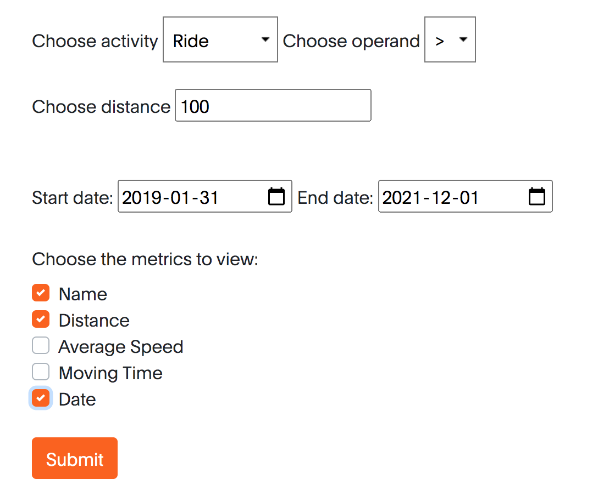
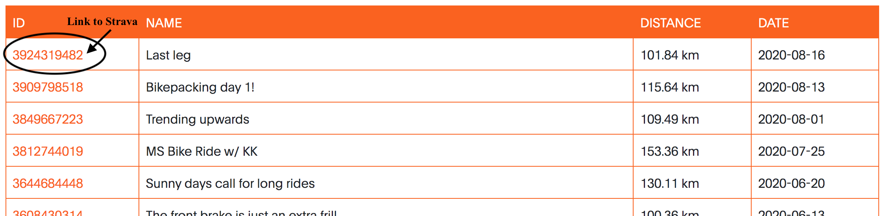
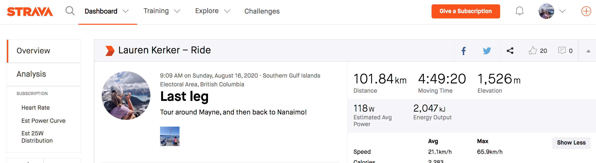
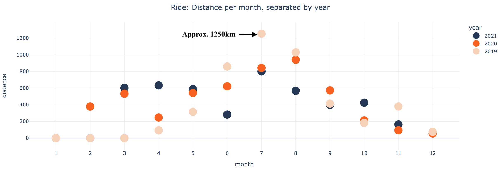
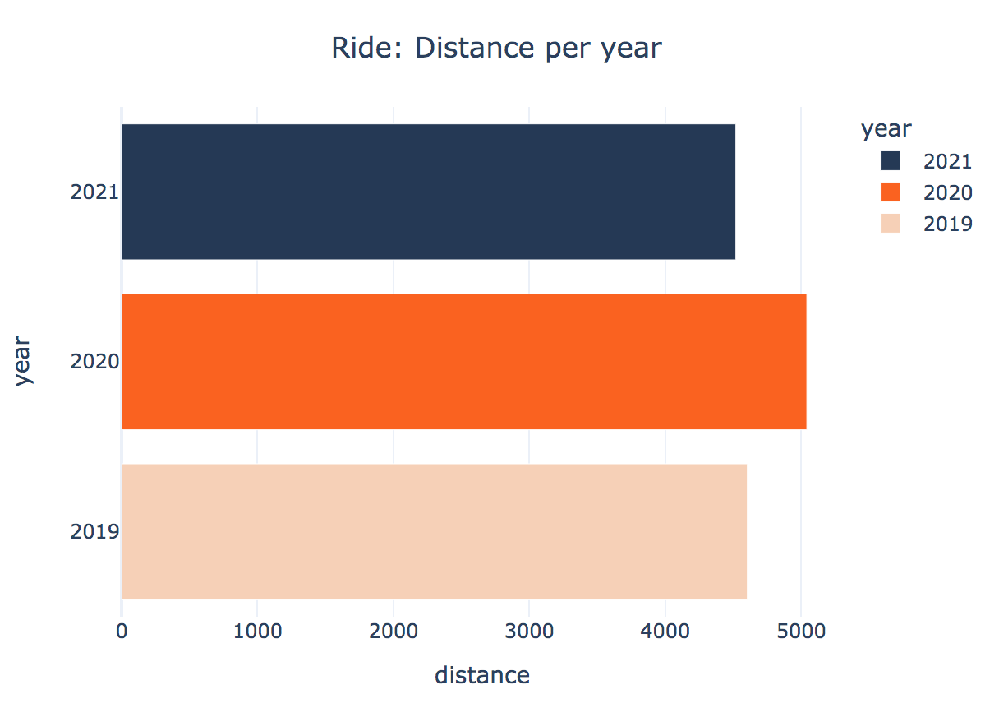
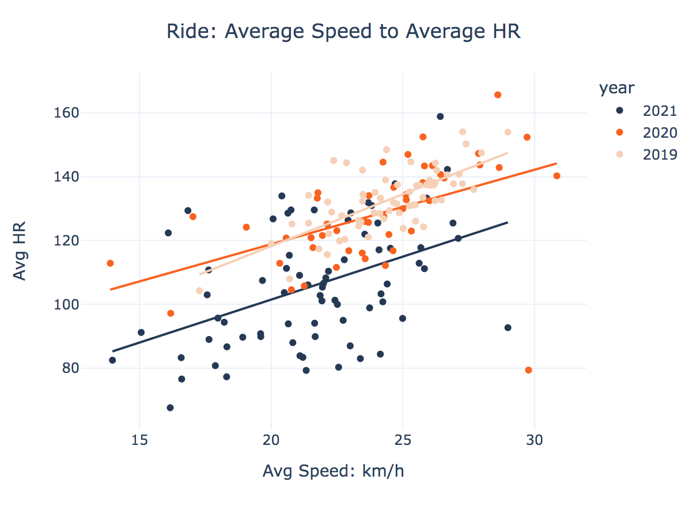
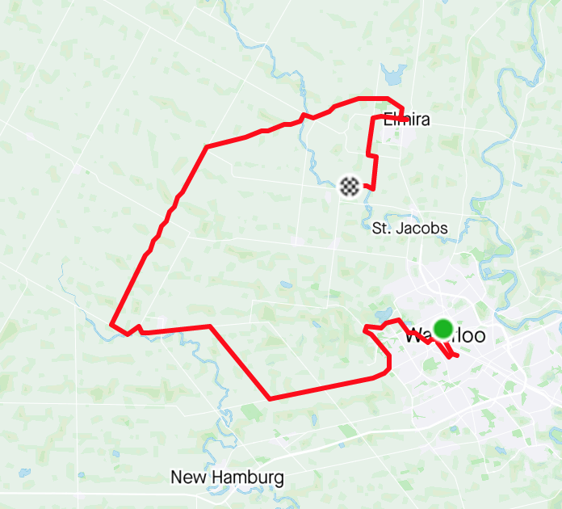
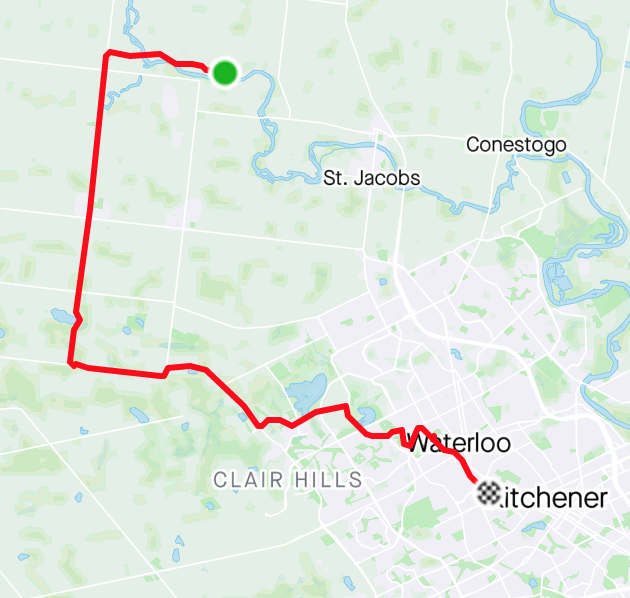
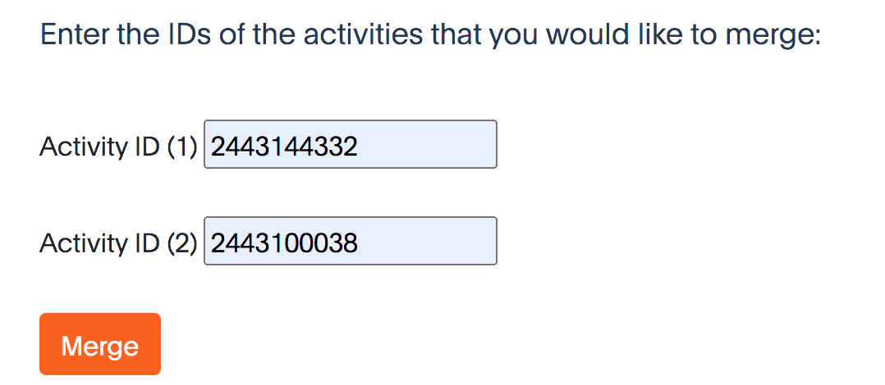
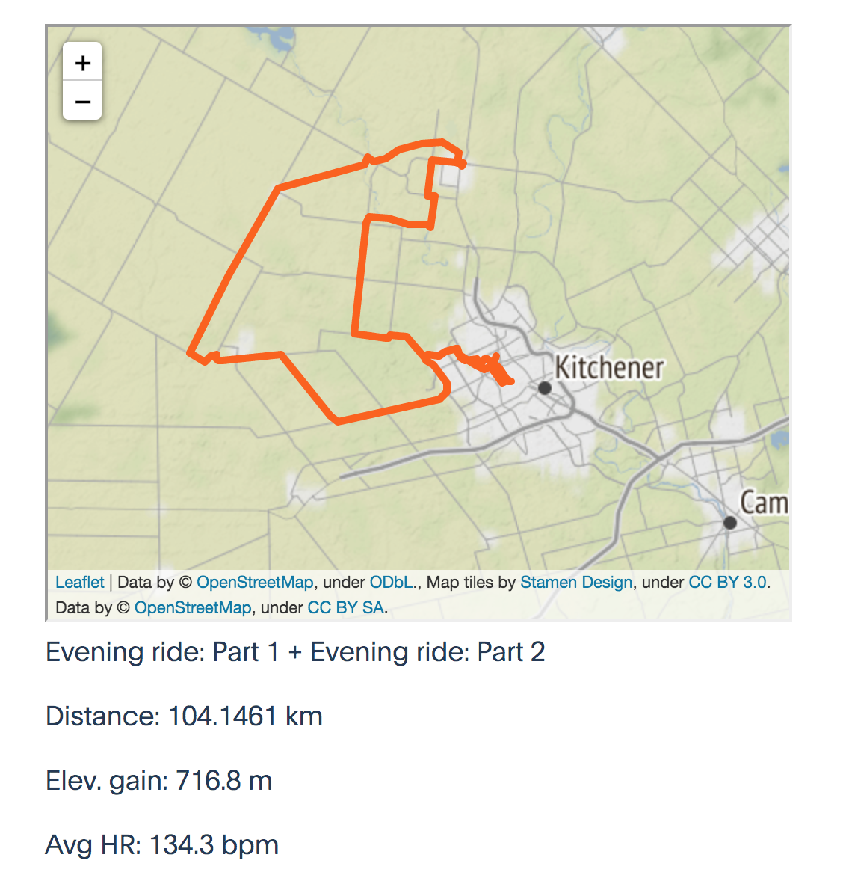

# strava_analysis

I created this application to implement easy filtering for the desktop version of Strava.

This application has three features:

# Filter
This feature allows the user to filter through their activities based on activity type, distance, and date. The user then can select which metrics they wish to view for the filtered activities: Name, Distance, Average Speed, Moving Time, and/or Date.
If the user selects nothing, then the app will output all the athlete's activities.
The ID of the activity is default, and it always shown. There is a link from the ID column to the acitvity on strava.com. Below is an example of filtering rides that are greater than 100km, and between Jan 31 2019 and Dec 1 2021:

After clicking "Submit", this is the output:

After clicking the ID of the activity titled "Last Leg", it redirects to the activity on Strava.com:

# Graph
This features plays off of Strava's "year in sport", but compares multiple years that the athlete has been on Strava.
Below is an example of visualizing rides from 2019, 2020 & 2021:

After clicking "Submit", 3 graphs will appear. 

Graph 1 shows the total distance, per month, per year. For example, in July 2019, I rode a record monthly distance of approx. 1250km. The graph also shows that I cycle more in the summer months:

Graph 2 shows the total distance, per year. For example, this graph shows that I rode the most in 2020, but overall my cycling mileage is pretty consistent. 

Graph 3 plots average speed against average heart rate. Ignoring external factors, we can conclulde that I was most fit in 2019 and that my fitness stayed pretty consistent in 2020 and 2021. However, I rode slower on average in 2021 compared to previous years. This graph is not a very good visual because of the external factors involved. The main factor is elevation. I moved to BC in 2020 from Ontario. We would expect my Ontario rides to be quicker at a lower heartrate because of the lack of elevation. This section is a work in progress...

I would like to expand this section and have a few ideas of how to do so. 
 - Histogram of distance of activities (primarily runs)
 - Find a way to isolate the environment - e.g. look at matched activities with the same segments
 - Graph average pace per time of day, but cap elevation

 # Merge
 This feature is something that I think would add to Strava. It is a merge feature for activities. For example, when an athlete accidentally stops their activity mid-way through, or their watch battery dies. This feature is also a work in progress. The criteria for the app to merge the activities together include: less than 10 minutes between the end time and start time of the activities and 0.001 degrees of lat/lon difference. 

 To use this feature currently, the user inputs the IDs of the activities that they would like to merge. If the activities meet the criteria, then the app will merge the map and the metrics. Averages are combined as a weighted average based on elapsed time and values such as distance and elevation are simply summed together. 

 For example, I have 2 rides from 2019 that I would like merged:

 

I enter the IDs of both rides:

After clicking "Submit", the merged map appears with some of the metrics below:

